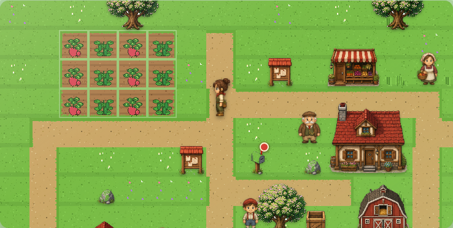
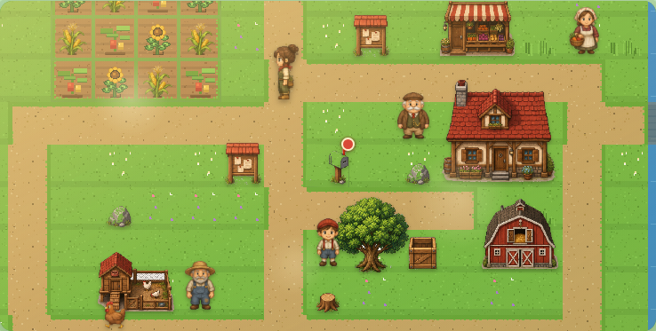
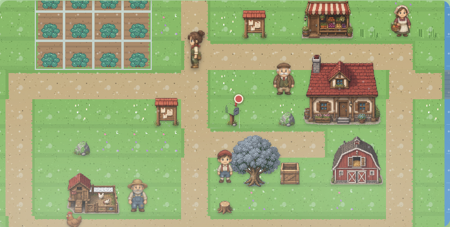

# 晨光農場（Pixel Idle Farm）


[](https://github.com/mars-tw/pixel-idle-farm-skill/actions/workflows/ci.yml)
[](LICENSE)
[](https://mars-tw.github.io/pixel-idle-farm-skill/)

《晨光農場》是一款以原生 HTML、CSS 與 JavaScript 製作的像素放置農場 RPG。玩家能在可走動的大地圖上耕作、接市集與 NPC 委託、照顧動物、修橋探索東林，並透過本機存檔與時間差結算持續累積農場進度。

**[立即線上遊玩](https://mars-tw.github.io/pixel-idle-farm-skill/)** ・目前遊戲版本：**R62**（`r62-20260715-1`）

## 最新特色

- **R60 高曝光農場素材清償**：鴨子 8 幀動作、鴨蛋三品質，以及豌豆／地瓜／冬甘藍／櫻桃蘿蔔／向日葵五階段成長圖集，全面對齊金標動物與作物的體積、描邊、光影和品質分級語言。
- **R59 主角動作圖集重繪**：Miri 與 Kai 各有 144 幀、24 列 × 6 幀的農務動作 atlas；澆水、鋤地、播種、收成、採集與建造皆以逐幀動作呈現，走路也有四方向步態與明顯肢體姿勢變化。
- **R59 作物品質重繪**：甜椒、馬鈴薯、葡萄與溫室甜瓜重新製作為 48 × 48 像素、五階段成長圖集；全遊戲共有 15 種作物與四季限定品項。
- **放置與離線進度**：作物、動物、季節與採集點依時間戳結算，離線收益最多計算 8 小時；升級幫手機器人後可自動收成，最高等級還能自動補種。
- **可探索農場世界**：22 × 12 tile map、camera 跟隨、y-sort 遮擋、任務目標導引、橋梁修復、東林採集與 NPC 對話／委託。
- **動物照護與品質經濟**：雞、牛、羊、蜜蜂與鴨會生產三種品質等級的農產品；餵食、補水與梳理會影響親密度及產出品質。
- **四季與天氣**：季節作物、節慶、祖母信箋、季相樹木、雨濕與雪地效果，讓農場隨時間改變。
- **PWA 與響應式介面**：支援 Service Worker 快取、安裝式體驗、本機 `localStorage` 存檔，以及桌機與手機版面。

## 畫面截圖

### 春季農場



### 夏季農場



### 冬季農場



## 操作說明

### 滑鼠與觸控

1. 從地圖上方選擇「手、澆水、清除、建造、查看」工具；種植時再選擇種子。
2. 點擊地圖目標，主角會自動走到可互動位置並執行動作。
3. 觸控裝置操作農地時，第一次點擊會顯示預覽，再點同一格才確認執行；滑鼠點擊則直接操作。
4. 從右側／下方分頁查看磚資訊、市集訂單、升級、故事與圖鑑；任務 Dock 的「前往／探索」可帶你前往目前目標。

### 鍵盤

- `W` `A` `S` `D` 或方向鍵：一次移動一格。
- `Esc`：關閉目前開啟的對話框。

### 建議開局流程

1. 走到告示牌或信箱啟動序章。
2. 選小麥種子，在農地種植並澆水。
3. 成熟後以「手」收成，再完成第一張市集訂單。
4. 清除樹樁與石塊取得材料，修復東邊斷橋。
5. 探索東林、照顧動物並用訂單收益升級田地、倉庫與自動化。

## 技術棧

| 類別 | 使用技術 |
|---|---|
| 執行環境 | 原生 HTML5、CSS3、JavaScript（無前端框架、無 runtime 套件） |
| 儲存與離線 | `localStorage`、Service Worker、Web App Manifest |
| 像素素材 | PNG sprite atlas、JSON frame map、專案內生成／切圖工具 |
| 測試 | Node.js、Playwright、DOM smoke、經濟／系統測試、atlas validators、RWD E2E |
| CI/CD | GitHub Actions、GitHub Pages |

素材與工具來源揭露請見 [CREDITS.md](CREDITS.md)；圖集製作方式另見 [v4 美術管線](references/art-pipeline-v4.md)。

## 本地開發

需求：建議使用 **Node.js 22**、npm、Python 3；完整 E2E 另需 Playwright Chromium。

```bash
git clone https://github.com/mars-tw/pixel-idle-farm-skill.git
cd pixel-idle-farm-skill
npm ci
npm start
```

開啟 <http://localhost:8000/>。本專案沒有 build step，靜態伺服器會直接提供 repo 根目錄內容。

### 執行測試

```bash
# 單元、系統、UI smoke 與 atlas 驗證
npm test

# 第一次執行 E2E 前安裝瀏覽器
npx playwright install chromium

# RPG 流程與 9 組響應式視口矩陣
npm run test:e2e
```

GitHub Actions 會在 pull request 與 `main` push 執行測試；只有 `main` 的測試與 E2E 全部通過後才部署 GitHub Pages。

## 專案結構

| 路徑 | 說明 |
|---|---|
| `index.html` | 頁面結構、樣式、PWA 啟動與社群分享 metadata |
| `src/config.js` | 作物、動物、地圖、任務、季節、訂單與經濟設定 |
| `src/state.js` | 存檔、遷移與初始狀態 |
| `src/game.js` | 遊戲規則與時間差結算 |
| `src/ui.js` | UI、地圖渲染、camera、輸入與逐幀動畫 |
| `src/atlas.js` | atlas 與 frame map 載入 |
| `assets/generated/` | 執行時 sprite atlas 與來源圖 |
| `scripts/` | 測試、截圖、素材生成與 atlas 處理工具 |
| `references/` | 設計、資料模型與美術管線文件 |

## 授權與致謝

本專案採 [MIT License](LICENSE)，Copyright © 2026 mars-tw。AI 輔助素材、系統字型、Unicode emoji 與開發工具的完整說明請見 [CREDITS.md](CREDITS.md)。
