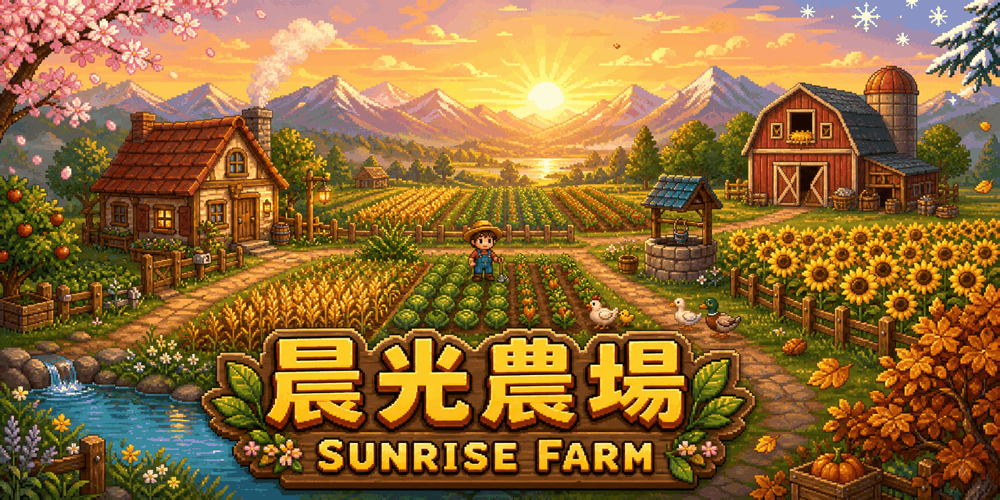
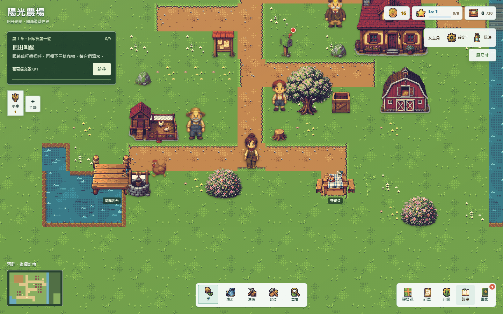
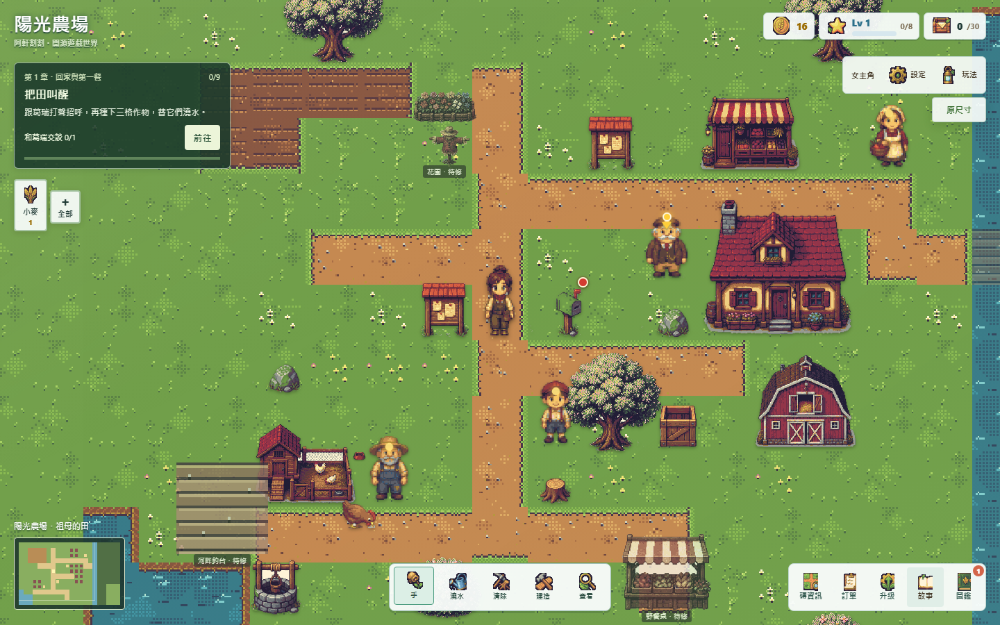
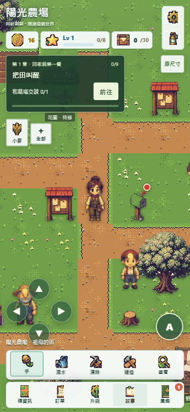
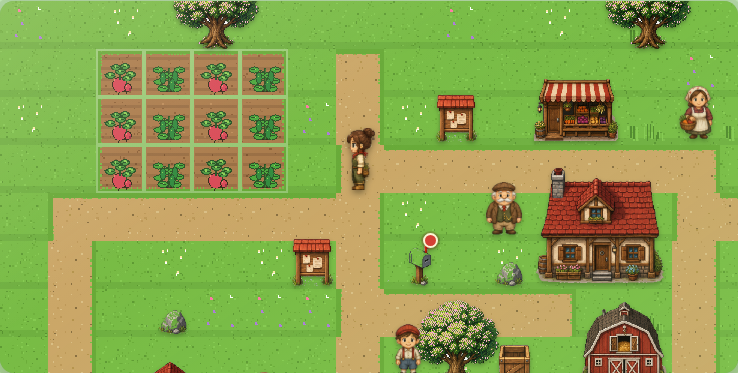
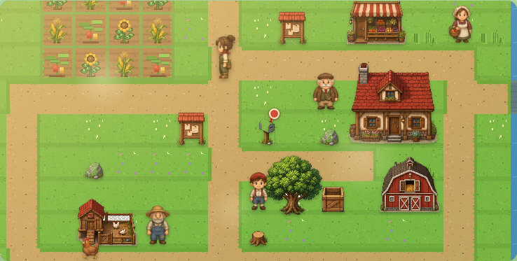
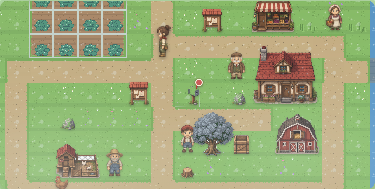

# 阿軒割割陽光農場開源遊戲世界



[](https://github.com/mars-tw/pixel-idle-farm-skill/actions/workflows/ci.yml)
[](LICENSE)
[](https://mars-tw.github.io/pixel-idle-farm-skill/)

《陽光農場》是一款原生 HTML、CSS 與 JavaScript 的像素農場 RPG。接下祖母留下的田地，替鎮民準備食物、修復河畔、照顧動物，讓這座農場重新有人來。作物與動物保留離線成長，主動遊玩則能做料理、釣魚、交付餐籃與探索東林。

**[線上遊玩](https://mars-tw.github.io/pixel-idle-farm-skill/)** ・目前版本：**R77**（`r77-20261002-1`）。

## R77 顯示修正

NPC 光點、任務箭頭與對話泡泡依角色圖片頂緣定位，包含發光和脈動的安全間距；同一 NPC 只顯示一個狀態標記。32 個按鈕圖示改用完整的單張透明 PNG，手機縮小時不再被固定圖集座標裁掉。詳見 [顯示修正紀錄](docs/r77-display-fix.md)。

## R76 素材更新

釣台和野餐桌各有專用的損壞／修復像素圖，取代借用的橋梁與市集攤位。四個 frame 統一為 96px、真透明背景、共用色盤和腳底錨點。釣台畫在池塘上方，從岸邊走近互動。

來源圖、完整提示詞、裁切工具和雜湊一起開源，見 [R76 素材與發布紀錄](docs/r76-art-release.md)。另修正野餐居民搬遷與新場址的讀檔衝突，保留既有建物和動物。

## R75 世界重製

主畫面改成完整視口的農場，相機跟著人物移動。手機預設保持可讀的圖磚大小；任務、訂單、升級與圖鑑按需要展開，地面沒有常駐格線。

新主線有三章九個任務：「回家與第一餐」、「河畔復興」、「收穫野餐」。收成會變成料理和居民委託；釣台、餐桌與花園能實際修復，結局後居民聚到河畔。多餘的魚和料理可繼續交付五分鐘一批的餐籃，缺木料／石材也能向市集補購。

規劃與任務驗收見 [R75 重製交付規格](docs/r75-world-rework.md)。R75 當時的 API 401 屬歷史紀錄；R76 已透過內建生圖工具交付專用物件，來源揭露見 [CREDITS.md](CREDITS.md)。

```bash
# 新主線規則與真瀏覽器玩法
npm run test:world
```

## 沿用系統

- **R67 選單分區與 modal 互斥**：手機側欄分頁、內容與底部五鍵列改為正常流獨立區段；modal 開啟時 app shell 原生 `inert`，D-pad、A 鍵與背景控制不可點穿。
- **R60 高曝光農場素材清償**：鴨子 8 幀動作、鴨蛋三品質，以及豌豆／地瓜／冬甘藍／櫻桃蘿蔔／向日葵五階段成長圖集，全面對齊金標動物與作物的體積、描邊、光影和品質分級語言。
- **R59 主角動作圖集重繪**：Miri 與 Kai 各有 144 幀、24 列 × 6 幀的農務動作 atlas；澆水、鋤地、播種、收成、採集與建造皆以逐幀動作呈現，走路也有四方向步態與明顯肢體姿勢變化。
- **R59 作物品質重繪**：甜椒、馬鈴薯、葡萄與溫室甜瓜重新製作為 48 × 48 像素、五階段成長圖集；全遊戲共有 15 種作物與四季限定品項。
- **放置與離線進度**：作物、動物、季節與採集點依時間戳結算，離線收益最多計算 8 小時；升級幫手機器人後可自動收成，最高等級還能自動補種。
- **可探索農場世界**：22 × 12 tile map、camera 跟隨、y-sort 遮擋、任務目標導引、橋梁修復、東林採集與 NPC 對話／委託。
- **動物照護與品質經濟**：雞、牛、羊、蜜蜂與鴨會生產三種品質等級的農產品；餵食、補水與梳理會影響親密度及產出品質。
- **四季與天氣**：季節作物、節慶、祖母信箋、季相樹木、雨濕與雪地效果，讓農場隨時間改變。
- **PWA 與響應式介面**：支援 Service Worker 快取、安裝式體驗、本機 `localStorage` 存檔，以及桌機與手機版面。

## 畫面截圖

### R76 河畔物件



此圖使用修復完成的畫面存檔，展示素材；不作為全程 UI 通關證明。

### R75 世界主畫面





以下為沿用素材的歷史季節畫面，介面以 R75 截圖為準。

### 春季農場



### 夏季農場



### 冬季農場



## 操作說明

### 滑鼠與觸控

1. 從地圖底部選擇「手、澆水、清除、建造、查看」工具；種植時再選擇種子。
2. 點擊地圖目標，主角會自動走到可互動位置並執行動作。
3. 手機點農地會出現地圖動作列；選動作後，人物走近並在動畫的作用階段結算。滑鼠可直接點擊目標。
4. 右下／下方選單可查看目標資訊、市集訂單、升級、手札與圖鑑。「前往」會走向任務需要的位置；交付也要走到居民旁。

### 鍵盤

- `W` `A` `S` `D` 或方向鍵：一次移動一格。
- `Esc`：關閉目前開啟的對話框。

### 建議開局流程

1. 跟葛瑞交談，在三格農地種小麥並澆水。
2. 收成後找班伯，保留小麥回農舍做第一份麥餅。
3. 用居民提供的建材修復釣台，等浮標進入綠色區段時提竿。
4. 清障或向市集補購建材，修橋到東林採薄荷。
5. 修好餐桌、照顧動物、交訂單，再準備料理和花園，邀請居民來野餐。

## 技術棧

| 類別 | 使用技術 |
|---|---|
| 執行環境 | 原生 HTML5、CSS3、JavaScript（無前端框架、無 runtime 套件） |
| 儲存與離線 | `localStorage`、Service Worker、Web App Manifest |
| 像素素材 | PNG sprite atlas、JSON frame map、專案內生成／切圖工具 |
| 測試 | Node.js、Playwright、DOM smoke、經濟／系統測試、atlas validators、RWD E2E |
| CI/CD | GitHub Actions、GitHub Pages |

素材與工具來源揭露請見 [CREDITS.md](CREDITS.md)；圖集製作方式另見 [v4 美術管線](references/art-pipeline-v4.md)。

## 本地開發

需求：建議使用 **Node.js 22**、npm、Python 3；完整 E2E 另需 Playwright Chromium。

```bash
git clone https://github.com/mars-tw/pixel-idle-farm-skill.git
cd pixel-idle-farm-skill
npm ci
npm start
```

開啟 <http://localhost:8000/>。本專案沒有 build step，靜態伺服器會直接提供 repo 根目錄內容。

### 執行測試

```bash
# 單元、系統、UI smoke 與 atlas 驗證
npm test

# 第一次執行 E2E 前安裝瀏覽器
npx playwright install chromium

# R75 真 UI 第一章、四視口及後段互動 fixture
npm run test:e2e
```

GitHub Actions 會在 pull request 與 `main` push 執行測試；只有 `main` 的測試與 E2E 全部通過後才部署 GitHub Pages。

## 專案結構

| 路徑 | 說明 |
|---|---|
| `index.html` | 頁面結構、樣式、PWA 啟動與社群分享 metadata |
| `src/config.js` | 作物、動物、地圖、任務、季節、訂單與經濟設定 |
| `src/state.js` | 存檔、遷移與初始狀態 |
| `src/game.js` | 遊戲規則與時間差結算 |
| `src/ui.js` | UI、地圖渲染、camera、輸入與逐幀動畫 |
| `src/adventure.js` | 三章任務、修復、料理、釣魚、餐籃委託與建材交易的純邏輯 |
| `src/world-ui.js` / `src/world.css` | 世界主畫面、新主線互動、短目標、居民反應與手機介面 |
| `src/atlas.js` | atlas 與 frame map 載入 |
| `assets/generated/` | 執行時 sprite atlas 與來源圖 |
| `scripts/` | 測試、截圖、素材生成與 atlas 處理工具 |
| `references/` | 設計、資料模型與美術管線文件 |

## 授權與致謝

本專案採 [MIT License](LICENSE)，Copyright © 2026 mars-tw。AI 輔助素材、系統字型、Unicode emoji 與開發工具的完整說明請見 [CREDITS.md](CREDITS.md)。
